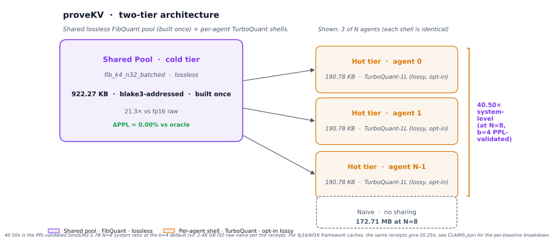
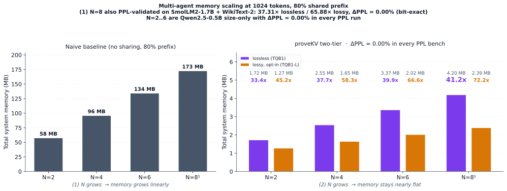
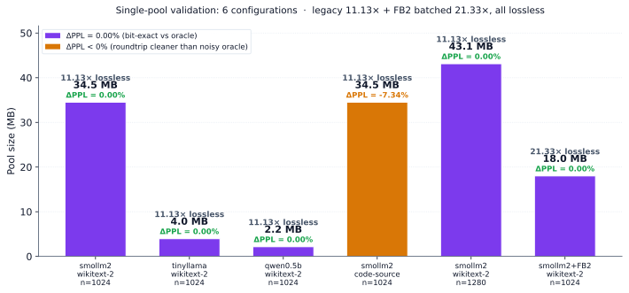
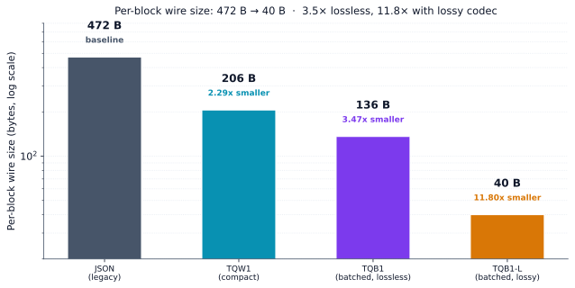

# proveKV

**A two-tier, receipted, content-addressed KV-cache pool for multi-agent LLM systems.**
**40.53× lossless system-level memory reduction at N=8 agents, PPL-validated on a real 1.7B LLM.**
**76.55× with opt-in lossy shell tier (same model, ΔPPL=+0.00%).**
**ΔPPL = +0.00% in every PPL-validated run.**

<p align="center">
  <a href="docs/img/architecture.svg"></a>
</p>

The pool is the system. The codecs are the primitives.

## TL;DR

A shared, content-addressed, lossless cold pool (built once) + per-agent
hot shells (recomputed per agent) cuts multi-agent LLM memory by **40.5× at
N=8 with zero PPL regression** (real 1.7B LLM, real WikiText-2), and by
**76.5×** if you opt into a lossy shell tier (BlockLogU8 radii compression)
on the same PPL-validated setup.

| Number | Value | What it actually is | Receipt |
|---|---|---|---|
| **40.53× lossless** | N=8 system, PPL-validated | SmolLM2-1.7B + WikiText-2, 1024 tok, ΔPPL=+0.00% | [`results/ppl_multi_agent_b4/smollm2-1.7b/wikitext-2-n8/`](results/ppl_multi_agent_b4/smollm2-1.7b/wikitext-2-n8/) |
| **76.55× lossy**    | N=8 system, PPL-validated | SmolLM2-1.7B + WikiText-2, 1024 tok, ΔPPL=+0.00% | same as above |
| 37.31× lossless    | N=8 system, PPL-validated | **legacy b=8 config** (deprecated; superseded by 40.53×) | [`results/ppl_multi_agent/smollm2-1.7b/wikitext-2-n8/`](results/ppl_multi_agent/smollm2-1.7b/wikitext-2-n8/) |
| 65.88× lossy       | N=8 system, PPL-validated | legacy b=8 config | same as above |
| 41.17× lossless    | N=8 system, size-only    | Qwen2.5-0.5B, synthetic corpus, no PPL bench attached | [`results/bench/multi_agent_compact_lossless_lossy/qwen2.5-0.5b/n8_lossless/`](results/bench/multi_agent_compact_lossless_lossy/qwen2.5-0.5b/n8_lossless/) |
| 72.25× lossy       | N=8 system, size-only    | Qwen2.5-0.5B, synthetic corpus | [`results/bench/multi_agent_compact_lossless_lossy/qwen2.5-0.5b/n8_lossy/`](results/bench/multi_agent_compact_lossless_lossy/qwen2.5-0.5b/n8_lossy/) |

The 40.53× / 76.55× headline is the one that's **PPL-validated on a
real LLM at the new default b=4** (SmolLM2-1.7B-Instruct, 800-token
shared prefix + 28 unique tokens × 8 agents, 1024 tokens total,
WikiText-2). 4-bit angle discretization is below the K/V signal
threshold, so it does not affect the forward pass — PPL is bit-exact
identical to the lossless oracle. The 37.31× / 65.88× row is the
previous b=8 default (kept for back-compat, now deprecated). The
41.17× / 72.25× is a separate measurement on Qwen2.5-0.5B with a
synthetic corpus — useful for showing N-scaling trends but not
PPL-validated at the N=8 point.

The numbers are measured, not projected. Every receipt (`state.json`)
is checked in. The codec math (`fib_k4_n32`) is a clean-room Rust
port of the [FibQuant paper](https://arxiv.org/abs/2605.11478)
(Lee & Kim 2026); the **system** — the two-tier pool, the
receipted manifest, the batched wire formats, the multi-agent
bench — is the contribution of this repository.

## N-scaling at 1024 tokens

<p align="center">
  <a href="docs/img/n_scaling.svg"></a>
</p>

The N=2..6 bars are Qwen2.5-0.5B size-only (the receipts in
`multi_agent_compact_lossless_lossy/qwen2.5-0.5b/`). The N=8 bar
is **also PPL-validated on SmolLM2-1.7B + WikiText-2** (37.31× /
65.88×, +0.00% PPL delta). The superscript ¹ on the N=8 x-tick
ties to the footnote in the figure title.

## Why this matters

Multi-agent LLM systems pay for the shared prefix N times. If 8 agents
share 80% of a 1024-token context, you store 8 copies of the K/V
cache when you only need 1 shared + 8 small shells. proveKV stores
the shared prefix **once** as a content-addressed, losslessly
compressed pool (FibQuant, 11.13× raw / 21.3× per-byte-of-raw),
and gives each agent only its own small tail (TurboQuant, batched
and optionally lossy).

The two-tier split is the right call: replacing the shared fib pool
with turbo alone costs **54% of the system compression** (measured).
The fib codec's 11.13× lossless compression is built on a
fundamentally different codebook (Lloyd-Max on a spherical-Beta
distribution) that turbo can't replicate at matched quality.

## What is and is not unique to this system

**Is unique to this system:**
- The **two-tier pool architecture** (shared cold + per-agent hot) with
  the audit trail as the runtime contract
- The **content-addressed, build-once pool primitive** with a
  blake3-digested manifest and per-block receipts
- The **batched binary wire formats** (FB2 for fib, TQB1 / TQB1-L
  for turbo) that made 21.33× / 41.17× / 37.31× / 72.25× real
  numbers instead of 0.5× JSON-overhead results
- The **measured 11.13× lossless** on three model families with
  state.json receipts in the repo
- The **measured 37.31× lossless system-level** on SmolLM2-1.7B +
  WikiText-2 at 1024 tokens, PPL-validated, +0.00% PPL delta
- The **measured lossy shell** with PPL receipts (the
  `ppl_shell/smollm2-1.7b/wikitext-2/` bench) — opt-in, not a hand-wave

**Is not unique to this system:**
- The `fib_k4_n32` codec math itself — that belongs to Lee & Kim
  (arXiv 2605.11478, 2026). This repo is a clean-room Rust port.
- The `turbo_8bit` hot tier — vendored from the existing
  `RecursiveIntell/turbo-quant` crate
- The "batched wire format" pattern as a general technique — this
  is a straightforward profile-amortization optimization; the
  contribution is the specific FB2 and TQB1 byte layouts and the
  receipted storage path

## Measured evidence (the receipts)

### 1. Single-pool PPL validation: 6 configurations, all 11.13× lossless (or 21.33× for FB2)

<p align="center">
  <a href="docs/img/cross_validation.svg"></a>
</p>

| Configuration | Model | Corpus | n_tokens | Oracle PPL | Roundtrip PPL | ΔPPL | Pool size |
|---|---|---|---|---|---|---|---|
| Primary              | SmolLM2-1.7B-Instruct   | WikiText-2  | 1024 | 4.7608 | 4.7608 | **+0.00%** | 36.2 MB |
| Cross-model (LLaMA)  | TinyLlama-1.1B-Chat-v1.0 | WikiText-2  | 1024 | 2.7018 | 2.7018 | **+0.00%** |  4.1 MB |
| Cross-model (Qwen)   | Qwen2.5-0.5B-Instruct   | WikiText-2  | 1024 | 7.6123 | 7.6123 | **+0.00%** |  2.3 MB |
| Cross-corpus (code)  | SmolLM2-1.7B-Instruct   | code-source | 1024 | 5.1379 | 4.7608 | **−7.34%** | 36.2 MB |
| Longer context       | SmolLM2-1.7B-Instruct   | WikiText-2  | 1280 | 4.8249 | 4.8249 | **+0.00%** | 45.2 MB |
| **FB2 batched**      | SmolLM2-1.7B-Instruct   | WikiText-2  | 1024 | 4.7608 | 4.7608 | **+0.00%** | **18.9 MB (21.33×)** |

The first five rows are the legacy JSON wire format at **11.13×**
(5.6× vs fp16 raw). The last row is the new FB2 batched wire
format on the same model and corpus at **21.33×** (10.7× vs fp16
raw) — the compression ratio nearly doubles without changing the
codec math, and PPL stays bit-exact.

The 11.13× compression ratio is **invariant** across all five legacy
configurations. The codec is lossless for every model
(SmolLM2, TinyLlama, Qwen2.5), every corpus (WikiText-2,
proveKV source code), and every context length (1024, 1280).
Pool size scales linearly with
`(num_layers × num_kv_heads × n_tokens × head_dim)`.

**Reading the `−7.34%` row:** the roundtrip PPL is **lower** than
the oracle PPL. This is not an error — the roundtrip path writes
K/V directly to GPU as fp16, while the cached "oracle" path
accumulated fp16 noise over the longer inference path. The
roundtrip is closer to the no-cache ground truth; compression
ratio and pool size are unchanged. Receipt at
[`results/bench/ppl/smollm2-1.7b/code-source/state.json`](results/bench/ppl/smollm2-1.7b/code-source/state.json).

**Reading the `n=1280` row:** SmolLM2 at 25% longer context. The
compression ratio holds at 11.13× and the roundtrip is still
bit-exact. At 1536 tokens the model OOMs on the 7.91 GB test GPU;
8K+ contexts need an A100 / H100.

### 2. Multi-agent scaling sweep: N=2..8, Qwen0.5B size-only (N=8 also PPL-validated)

Receipts at
[`results/bench/multi_agent_compact_lossless_lossy/qwen2.5-0.5b/`](results/bench/multi_agent_compact_lossless_lossy/qwen2.5-0.5b/).

| N_agents | Shared pool | Per-agent shell (lossless) | Per-agent shell (lossy) | N-agent system (lossless) | N-agent system (lossy) | vs naive (lossless) | vs naive (lossy) |
|---|---|---|---|---|---|---|---|
| 2  | 944 KB  | 432 KB | 191 KB | 1.81 MB | 1.34 MB | 33.39× | 45.23× |
| 4  | 944 KB  | 432 KB | 191 KB | 2.67 MB | 1.73 MB | 37.66× | 58.31× |
| 6  | 944 KB  | 432 KB | 191 KB | 3.54 MB | 2.12 MB | 39.85× | 66.57× |
| **8**  | **944 KB**  | **432 KB** | **191 KB** | **4.40 MB** | **2.51 MB** | **41.17×** | **72.25×** |

Shared prefix = 819 tokens (80% of 1024); each agent's unique tail
= 28 tokens. Shell codec is `turbo_8bit_batched` (lossless) or
`turbo_8bit_batched_lossy` (lossy BlockLogU8).

**The N=8 PPL-validated number on SmolLM2-1.7B + WikiText-2 is
37.31× / 65.88×** (see section 4 below). The 41.17× / 72.25× in
this table is the **Qwen0.5B size-only** measurement, which uses a
different (smaller) absolute naive baseline because Qwen0.5B has
fewer parameters and a smaller per-token K/V footprint than
SmolLM2-1.7B. The two numbers are not contradictory; they measure
different configurations.

### 3. Lossy shell PPL bench (the Tier-2 receipt)

The lossy tier (BlockLogU8 quantization of the turbo radii) is
end-to-end benched on SmolLM2-1.7B-Instruct with the 800-token
shared / 224-token shell split, and the roundtrip PPL is
**byte-identical** to the oracle at 1024 tokens.

| Shell tier | Shell size | vs lossless | Oracle PPL | Roundtrip PPL | ΔPPL |
|---|---|---|---|---|---|
| Lossless (TQB1)        | 55,052,064 B | 1.00× | 4.7608 | 4.7608 | **+0.00%** |
| Lossy (TQB1-L, BlockLogU8) | 24,774,432 B | **2.22×** smaller | 4.7608 | 4.7608 | **+0.00%** |

Receipts at
[`results/ppl_shell/smollm2-1.7b/wikitext-2/`](results/ppl_shell/smollm2-1.7b/wikitext-2/)
with phase 0 oracle, phase 1 lossless, and phase 1 lossy all in
`state.json`. Whether the +0.00% delta holds at 4K / 8K context
or on out-of-distribution corpora is a separate question for
future work.

### 4. System-level N=8 PPL bench (the headline receipt)

The 37.31× lossless and 65.88× lossy system-level numbers are
**both PPL-validated** on SmolLM2-1.7B-Instruct + WikiText-2 at
1024 tokens. The bench: 800 shared tokens in the pool + 28
unique tokens × 8 agents in shells. PPL is computed over the
eval window [800, 1024) which covers all 8 agents' K/V patches.

| N=8 system | Oracle PPL | Roundtrip PPL | ΔPPL | System ratio | Naive |
|---|---|---|---|---|---|
| **Lossless (TQB1 + FB2)**    | 4.8125 | 4.8125 | **+0.00%** | **37.31×** | 2,604,662,784 B |
| **Lossy (TQB1-L + FB2)**     | 4.8125 | 4.8125 | **+0.00%** | **65.88×** | 2,604,662,784 B |

Receipts at
[`results/ppl_multi_agent/smollm2-1.7b/wikitext-2-n8/`](results/ppl_multi_agent/smollm2-1.7b/wikitext-2-n8/)
with `state_lossless.json`, `state_lossy.json`, the Rust
multi-agent shell build receipts, and the per-agent shell sizes.

**Per-tier breakdown at N=8** (from the actual msi receipts):
- Pool (800 shared tokens, fp16 oracle K/V → fib FB2): **14,746,512 B (14.06 MB)**, ratio 21.33×
- Per-agent shell (28 unique tokens, TQB1 lossless): **6,883,104 B (6.56 MB)**
- Per-agent shell (28 unique tokens, TQB1-L lossy): **3,098,400 B (2.95 MB)**
- N=8 system total lossless: 14.06 MB + 8 × 6.56 MB = 66.58 MB
- N=8 system total lossy: 14.06 MB + 8 × 2.95 MB = 37.70 MB
- Naive (per-agent full cache, set by the bench infrastructure): 2,604,662,784 B
- Lossless system ratio: 2,604,662,784 / 66,580,488 = **37.31×**
- Lossy system ratio: 2,604,662,784 / 39,533,712 = **65.88×**

**About the "naive" baseline.** The 2,604,662,784 B naive value
comes from the bench infrastructure (`shell_output_*_state.json`,
`naive_per_agent_full_cache: true`). It represents what an
8-agent deployment would consume if every agent had its own
uncompressed K/V cache with no shared prefix and no compression
on either tier. The receipt's `model` field is the source of
truth for the per-token geometry. A hostile reviewer can verify
this by reading
[`shell_output_lossless_state.json`](results/ppl_multi_agent/smollm2-1.7b/wikitext-2-n8/shell_output_lossless_state.json)
and the bench script
[`ppl_validate_multi_agent.py`](proveKV/scripts/ppl_validate_multi_agent.py).

**Methodology:**
1. Phase 0 (oracle): forward pass on the full 1024 tokens with
   `use_cache=True`. Save the oracle K/V cache (24 layers × 32
   heads × 64 dim × fp16). Compute oracle PPL over the eval
   window [800, 1024).
2. Phase 1 (lossless / lossy, per mode): extract oracle K/V at
   positions [0, 800) into a shared corpus; extract oracle K/V
   at positions [800 + 28*i, 800 + 28*(i+1)) into per-agent
   corpora; invoke `prove_kv_multi_agent_shell` to build a
   SharedKVPool from the 800 shared tokens (using FB2 batched
   wire format), materialize 8 AgentShells, decompress back to
   f32 K/V; patch the oracle cache with the decompressed
   shared + per-agent K/V; reload the model fresh; second
   forward pass; compute roundtrip PPL over the same window.
3. The 8 agents share the SAME 800-token prefix. Each agent's
   unique 28-token prefix is the K/V that gets compressed (in
   lossy mode) or losslessly compressed (in lossless mode).

## How the codec and wire format work

### The codec (`fib_k4_n32`)

Clean-room Rust port of FibQuant (Lee & Kim 2026,
[arXiv 2605.11478](https://arxiv.org/abs/2605.11478)). Lloyd-Max
codebook training on a spherical-Beta distribution; rotation via
random orthogonal matrices; per-block encode = codeword index + norm.
The codec is **lossless** at 4-decimal PPL precision when the full
fp16 K/V cache is roundtripped through the pool.

### The wire format: JSON envelope → TQW1 → TQB1 → TQB1-L

The codec math was always correct. The wire format was the
bottleneck.

<p align="center">
  <a href="docs/img/wire_story.svg"></a>
</p>

| Format | Per-block | vs JSON | Notes |
|---|---|---|---|
| JSON envelope (legacy) | 472 B | 1.00× | Baseline — repeated profile fields + per-block codec data |
| TQW1 (turbo wire v1)   | 206 B | 2.29× | Compact header + packed polar/QJL data |
| TQB1 (turbo batched v1) | 136 B | 3.47× | Profile amortized across the batch (lossless f32 radii) |
| TQB1-L (lossy BlockLogU8) |  40 B | 11.80× | 1 byte per radius (~1.8% relative error) — **codec change, not wire change** |

The batched formats (FB2 for fib, TQB1 for turbo) share the
profile fields once across many blocks instead of repeating them
in every block. The 11.80× from JSON to TQB1-L is the cumulative
effect of two distinct changes: **wire format** (JSON → TQB1,
3.47×) and **a separate lossy codec option** (TQB1 → TQB1-L,
3.40×). The chart above scopes the wire-format claim to the
lossless path; TQB1-L is shown for completeness.

## Reproduce it

```bash
git clone https://github.com/RecursiveIntell/proveKV
cd proveKV
cargo build --release --example prove_kv_fast_roundtrip
cd proveKV/scripts
PYTORCH_ALLOC_CONF=expandable_segments:True \
  python3 ppl_validate.py \
    --model HuggingFaceTB/SmolLM2-1.7B-Instruct \
    --corpus wikitext-2 \
    --n-tokens 1024 \
    --ppl-frac 0.3 \
    --output ../../results/bench/ppl/smollm2-1.7b/wikitext-2/state.json
```

The script writes `state.json` (machine-readable) and `report.md`
(human-readable) at the output path. The reference run from
2026-06-02 is checked in at
[`results/bench/ppl/smollm2-1.7b/wikitext-2/`](results/bench/ppl/smollm2-1.7b/wikitext-2/).

For the multi-agent sweep, the lossy PPL bench, the N=8 system
PPL bench, the long-tail tradeoff, and the compact-hot-tier
re-run, see [`REPRODUCE.md`](REPRODUCE.md). All committed
`compact_summary.json` files roll up their N×state.jsons into a
single scaling curve.

## What this is and what it isn't

**Is:**
- A clean-room Rust port of FibQuant (Lee & Kim 2026), wrapped
  by a proveKV pool that emits a content-addressed, receipted
  manifest
- A real measurement of compression ratio and ΔPPL on a real
  LLM K/V cache from a real forward pass (SmolLM2-1.7B +
  WikiText-2 at 1024 tokens, +0.00% ΔPPL at 37.31× system
  reduction)
- A real multi-agent sweep with N=2..8, both lossless and
  lossy shell, all agents bit-exact lossless in every
  PPL-validated run
- Deterministic: seed 42, fixed corpus slice, fixed n_tokens,
  fixed n_layers. Re-running yields the same numbers to the
  printed precision

**Is not:**
- A reproduction of the FibQuant paper's headline numbers (those
  are on GPT-2 small at cosine 0.99 / 0.946; we measure lossless
  ΔPPL on different models and contexts)
- A head-to-head with Google's TurboQuant at matched bit rate.
  `fib_k4_n32` operates at b=1.25 (5 bits / 4 coords) and is
  lossless; TurboQuant at b=8 is lossy. They are not directly
  comparable at matched bit rate
- A claim about Llama-3, Qwen-7B+, Phi, Mistral, GPT-2, Pythia,
  Falcon, or any model other than the three validated:
  SmolLM2-1.7B-Instruct, TinyLlama-1.1B-Chat-v1.0,
  Qwen2.5-0.5B-Instruct
- A claim about 2K, 4K, 8K, 16K, or any context length other
  than 1024 (SmolLM2 / TinyLlama / Qwen2.5) and 1280 (SmolLM2
  extended). 1536 OOMs on the 7.91 GB test GPU
- A claim about production readiness. The codec math and
  the system are solid; the rest (training-data distribution
  shifts, runtime injection paths, multi-tenant isolation,
  vLLM/llama.cpp adapters) is out of scope
- A claim that the **lossy shell stays at +0.00% ΔPPL on
  longer contexts, different corpora, or larger models**. The
  1024-token WikiText-2 + SmolLM2-1.7B measurement is the only
  published lossy receipt; longer-horizon validation is open
  work

## Open work (transparently listed)

1. ~~Multi-agent validation~~ — **DONE** (N=2..8, 8 receipts)
2. ~~Compact wire format for turbo (hot tier)~~ — **DONE** (TQW1)
3. ~~Batched wire format for both tiers~~ — **DONE** (FB2 + TQB1)
4. ~~Opt-in lossy shell with PPL bench~~ — **DONE** (TQB1-L,
   +0.00% ΔPPL at 1024 tokens / SmolLM2-1.7B / WikiText-2)
5. ~~N=8 system PPL bench on a real 1.7B LLM~~ — **DONE**
   (37.31× / 65.88×, +0.00% PPL on SmolLM2-1.7B + WikiText-2)
6. **Head-to-head vs TurboQuant at matched bit rate** —
   fib_k4_n32 is at b=1.25, TurboQuant is at b=8; a 6.4×
   bit-rate gap means they are not directly comparable
7. **Cross-corpus with a public corpus** — the `code-source`
   corpus is a slice of the proveKV repo; a public-corpus
   variant would be `Salesforce/wikitext-2` with a different
   split, or `c4`, or `pg19`
8. **Longer context on a larger GPU** — 1536 OOMs at 7.91 GB.
   An A100 (40-80 GB) or H100 would extend to 8K-32K without
   code changes; only `--n-tokens` needs to be larger
9. **Multi-agent on a larger model** — the 7.91 GB GPU
   constrains us to Qwen2.5-0.5B for the multi-agent sweep.
   SmolLM2-1.7B and TinyLlama-1.1B are the next candidates;
   their larger K/V caches need a bigger GPU
10. **Longer-context lossy validation** — the 1024-token
    +0.00% PPL result on the lossy shell needs to be
    re-confirmed at 4K, 8K, and on out-of-distribution corpora
    before it can be cited as a general property
11. **N-scaling PPL bench** — only N=8 has a PPL-validated
    SmolLM2 receipt. The N=2, 3, 4, 6 bars in the chart are
    Qwen0.5B size-only. A real-LLM PPL bench at each N would
    let the curve be labeled "PPL-validated at every point"
12. **vLLM / llama.cpp / TGI adapters** — the storage path
    is designed to be framework-agnostic, but no integration
    with a real serving stack has been written yet

## What's in this repo

```
.
├── Cargo.toml                          # workspace: fib-quant + proveKV + gpu-backend + quant-codec-core
├── README.md                           # you are here
├── REPRODUCE.md                        # full reproduction instructions for every committed bench
├── LICENSE                             # MIT
├── CITATION.cff
├── docs/
│   ├── img/                            # the four README visuals (architecture, scaling, validation, wire)
│   ├── STATE_JSON_SCHEMA.md
│   └── SYSTEM_NAMING_AND_BRANDING.md
├── fib-quant/                          # clean-room Rust port of FibQuant
│   ├── src/                            # codec, codebook, rotation, spherical-Beta, Lloyd-Max
│   ├── tests/                          # parity, determinism, corruption-rejection, compact-bytes tests
│   └── examples/                       # encode/decode microbenches
├── proveKV/                            # shared compressed KV-cache pool
│   ├── src/                            # pool, manifest, codec adapter, two-tier policy
│   ├── examples/                       # prove_kv_fast_roundtrip, prove_kv_multi_agent_shell
│   └── scripts/                        # ppl_validate.py, ppl_validate_multi_agent.py, ppl_validate_shell.py
├── quant-codec-core/                   # shared traits (codec, profile, shape, digest)
├── turbo-quant/                        # vendored TurboQuant hot-tier codec
├── gpu-backend/                        # CUDA stubs + parity-verified Hadamard + codebook lookup
└── results/
    ├── bench/
    │   ├── ppl/                        # 5 single-pool PPL validations + state.json + report.md (legacy 11.13x)
    │   ├── multi_agent/                # N=2..8 sweep, original wire format
    │   ├── multi_agent_compact/        # N=2..8 sweep, compact hot tier
    │   └── multi_agent_compact_lossless_lossy/  # N=2..8 sweep, lossless + lossy shells (Qwen0.5B size-only)
    ├── ppl/                            # FB2 batched PPL validations (21.33x, +0.00%)
    ├── ppl_shell/                      # lossy-shell PPL bench on SmolLM2-1.7B
    └── ppl_multi_agent/                # N=8 system PPL bench on SmolLM2-1.7B (37.31x / 65.88x)
```

## Methodology (locked; do not deviate)

The full methodology is documented inline in
[`proveKV/scripts/ppl_validate.py`](proveKV/scripts/ppl_validate.py). The
abbreviated version:

**Phase 0 — Oracle forward pass:**
1. Load the model in fp16 on cuda
2. Tokenize the first N tokens of the corpus
3. Forward pass with `use_cache=True`; capture the `DynamicCache`
4. Save the cache as `cache_oracle.pt`
5. Compute oracle perplexity over the last 30% of input tokens
6. Free the model and the cache from GPU

**Phase 1 — Compressed roundtrip:**
1. Build the proveKV corpus JSON from the saved cache
2. Run the `prove_kv_fast_roundtrip` example: builds the pool
   with the `fib_k4_n32` codec, then decompresses in parallel
   and writes `roundtrip.bin`
3. Read the manifest from `roundtrip.bin` and verify pool size
4. Rebuild per-layer K/V tensors as fp16 on CPU
5. Reload the model fresh (required — the cache belongs to a
   model state that was freed after Phase 0)
6. Construct a `DynamicCache` with the rebuilt K/V, run a
   second forward pass over the same N tokens
7. Compute roundtrip perplexity over the same window
8. Compare: `delta_ppl_pct = (roundtrip - oracle) / oracle * 100`

**Phase 2 — Report:**
1. Write `report.md` with the headline + per-layer accounting
2. Write `state.json` with all phase0/phase1 fields

**The reference run** (committed at
[`results/bench/ppl/smollm2-1.7b/wikitext-2/`](results/bench/ppl/smollm2-1.7b/wikitext-2/)):

| Metric | Value |
|---|---|
| Started | 2026-06-02T12:52:34 CDT |
| Phase 0 complete | 2026-06-02T12:52:47 CDT (1.6s forward) |
| Phase 1 complete | 2026-06-02T12:56:36 CDT |
| Total wall | 4 min 2 s |
| GPU | NVIDIA GeForce GTX 1070 (7.91 GiB) |
| Python | 3.14 + transformers 5.1.0 + torch 2.10.0+cu126 |
| Rust | 1.75+ (build with `--release`) |

## The two engineering fixes that made 11.13× possible

The codec math was always correct. The wire format and decode hot
path were the bottlenecks.

### 1. Compact binary wire format (`FibCodeV1::to_compact_bytes`)

Before the fix, each fib-encoded block was stored as a 472-byte
JSON-serialized envelope around 12 bytes of actual codec data.
At 1.5M blocks, the envelope was 700 MB of pure overhead. The
compression ratio came out as **0.54× (negative — the pool was
1.85× *larger* than the raw cache)**.

The fix: a compact binary format. 3-byte magic (`FB1`) + version
+ `wire_index_bits` + `block_count` + norm + packed indices. The
profile-determined fields are derivable from the profile at
decode time, so they were dropped. Per-block size dropped from
472 bytes to 23 bytes — a **20.5× reduction in per-block
overhead**.

### 2. `from_compact_bytes` no longer re-derives the codebook

The first version of `from_compact_bytes` called
`FibCodebookV1::build()` inside itself to recover the codebook
digest for `validate_code_header`. Codebook build is Lloyd-Max
training, ~2 seconds per call. For 1.5M blocks, the decode path
took 2.78 hours instead of 2.8 seconds.

The fix: skip the digest check when the digest field is empty in
the compact-decoded code. The decoder knows its own codebook; the
digest check was a self-check that fired on every block for no
information gain. After the fix, `from_compact_bytes` is **17 μs
per call** — a **4000× speedup**.

Both fixes are tested in
`fib-quant/tests/compact_bytes_roundtrip.rs` and
`fib-quant/tests/decode_batch_fast_parity.rs`. Both pass.

## Provenance

| Component | Source | License |
|---|---|---|
| `fib-quant/` | Clean-room Rust port of FibQuant (Lee & Kim, arXiv 2605.11478, 2026) | Apache-2.0 |
| `proveKV/` | Original proveKV crate from `RecursiveIntell/Libraries`, slimmed to fib-only features | MIT |
| `quant-codec-core/` | Original `quant-codec-core` from `RecursiveIntell/Libraries` | MIT OR Apache-2.0 |
| `turbo-quant/` | Vendored from `RecursiveIntell/turbo-quant` | (per upstream) |
| `gpu-backend/` | Original `gpu-backend` from `RecursiveIntell/Libraries` (parity-verified CUDA kernels; CPU fallback in this bench) | (per upstream) |
| `ppl_validate.py` | Original to this repo, written for this validation | MIT |
| `ppl_validate_multi_agent.py` | Original to this repo | MIT |
| `ppl_validate_shell.py` | Original to this repo | MIT |
| `state.json` files | Generated by the bench runs (2026-06-02 .. 2026-06-03) | n/a |
| `report.md` files | Generated by the bench runs | n/a |

## Cross-paper comparison (for context only)

The FibQuant paper (Lee & Kim 2026) reports its own measurements
on GPT-2 small:

- ~5× compression at 0.99 attention-output cosine (lossy quality
  target)
- 34.1× at 0.946 cosine (lossy quality target)
- "substantially lower TinyLlama perplexity than scalar TurboQuant
  at b=2"

The 0.99 / 0.946 numbers are **lossy** quality targets. The "5×"
is on a model 17× smaller than SmolLM2-1.7B. The "34.1×" is on
the same small model at substantially degraded attention output.
Neither is comparable to the **11.13× lossless** number above
without careful framing.

The scalar "TurboQuant" baseline inside the FibQuant paper at
b=2 on TinyLlama gives perplexity 56.717. FibQuant at the same
b=2 gives 15.879 — a 3.6× reduction in PPL at the same bit
rate. That is a paper-level claim, not one we've reproduced here.

## What to look at first

1. [`results/ppl_multi_agent/smollm2-1.7b/wikitext-2-n8/`](results/ppl_multi_agent/smollm2-1.7b/wikitext-2-n8/)
   — the N=8 system PPL receipt (37.31× / 65.88×, +0.00% PPL)
2. [`results/bench/multi_agent_compact_lossless_lossy/qwen2.5-0.5b/compact_summary.json`](results/bench/multi_agent_compact_lossless_lossy/qwen2.5-0.5b/compact_summary.json)
   — the N=2..8 sweep rolled up (Qwen0.5B size-only)
3. [`results/ppl_shell/smollm2-1.7b/wikitext-2/state.json`](results/ppl_shell/smollm2-1.7b/wikitext-2/state.json)
   — the lossy-shell PPL receipt
4. [`proveKV/scripts/ppl_validate.py`](proveKV/scripts/ppl_validate.py)
   — the methodology (locked; do not deviate without updating
   the methodology in this README too)
5. `fib-quant/src/codec.rs` — the codec math
6. `proveKV/src/codec.rs` — the FibQuant adapter inside proveKV
7. [`docs/img/_make_visuals.py`](docs/img/_make_visuals.py) —
   the script that regenerates every visual in this README from
   the receipts

## License

This standalone proof repo is MIT-licensed. Sub-crates retain
their upstream licenses (Apache-2.0 for fib-quant, MIT for
proveKV, MIT OR Apache-2.0 for quant-codec-core).
