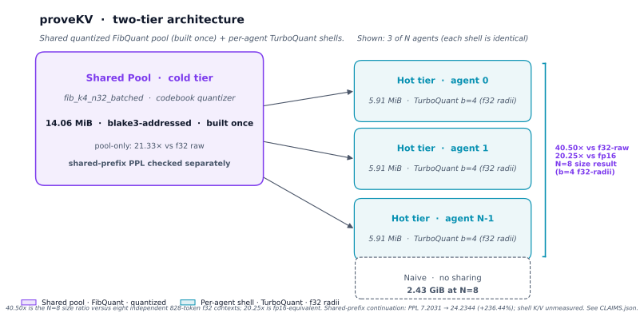
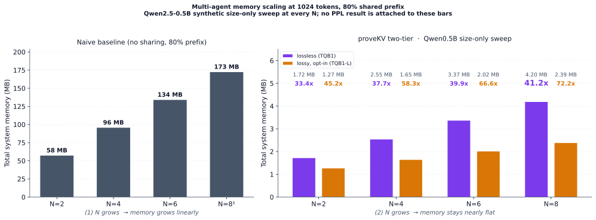
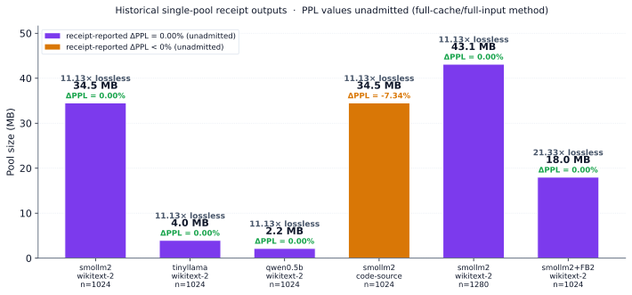
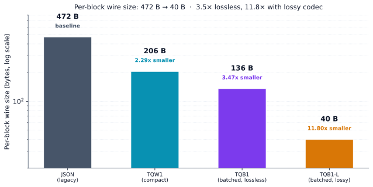

# proveKV

<!-- last-verified: 2026-09-06 -->

**A two-tier, receipted, content-addressed KV-cache pool for multi-agent LLM systems.**
**F32-radii shell profile: 40.50× vs f32-raw KV (20.25× vs fp16-equivalent). BlockLogU8-radii shell profile: 76.54× vs f32-raw KV (38.27× vs fp16-equivalent).**
**Fresh cache-aligned shared-prefix continuation check: oracle PPL 7.203125, roundtrip PPL 24.234375 (+236.44%) on exact target indices [800, 1024).**

The size ratios use eight independent contexts of 800 shared + 28 unique tokens. The PPL check uses one 1024-token aggregate fixture containing the same shared prefix and eight contiguous 28-token slices. It loads reconstructed shared-prefix K/V only; the shell K/V receipts support the size result but are not consumed by this score. It does **not** establish eight independent-prompt PPL results. The current N=8 PPL-neutrality claim is not publication-eligible.

<p align="center">
  <a href="docs/img/architecture.svg"></a>
</p>

The pool is the system. The codecs are the primitives.

## TL;DR

A shared, content-addressed cold pool (built once) + per-agent hot
shells (recomputed per agent) reduces the stored representation by
**40.50× for the f32-radii shell profile** or **76.54× for the
BlockLogU8-radii shell profile** at N=8 against an explicit
f32 independent-context baseline. On a separate aggregate SmolLM2-1.7B +
WikiText-2 fixture, a reconstructed shared-prefix continuation check produced
PPL 24.234375 versus the 7.203125 oracle (+236.44%) over 224 targets.

If your framework's cache is fp16 or bf16, the same receipts give
**20.25× f32-radii / 38.27× BlockLogU8-radii** — half the f32-raw number,
because the compressed bytes are dtype-agnostic. **proveKV does not
reduce framework cache bytes directly**: it decompresses to f32
and patches the cache. The ratio is "compressed proveKV bytes vs
the uncompressed independent-context KV size baseline." All byte counts
are measured, not projected. Pick the row that matches your
framework's cache dtype:

> **Baseline contract.** Each independent agent context contains
> 800 shared + 28 unique tokens. With 24 layers, 32 K/V heads, head
> dimension 64, K+V, and 4-byte f32 elements, the N=8 denominator is
> `8 × 828 × 24 × 32 × 64 × 2 × 4 = 2,604,662,784` bytes. The
> fp16/bf16-equivalent denominator is exactly half. See
> [`docs/methodology/naive_computation.md`](docs/methodology/naive_computation.md).

| Baseline | F32-radii (`lossless` mode) | BlockLogU8-radii (`lossy` mode) | Notes |
|---|---|---|---|
| **vs f32-raw KV** (4 B/elem) | **40.50×** | **76.54×** | Eight independent 828-token contexts, uncompressed f32 K/V bytes. |
| **vs fp16-equivalent KV** (2 B/elem) | **20.25×** | **38.27×** | Paper ratio for fp16-framework-cache readers. Half the f32 number. |
| **vs bf16-equivalent KV** (2 B/elem) | **20.25×** | **38.27×** | Same as fp16-equivalent. |

### What the headline number means — and what it doesn't

| What proveKV measures | Value | Notes |
|---|---|---|
| Ratio vs **f32-raw KV** baseline | 40.50× f32-radii / 76.54× BlockLogU8-radii | Eight independent 828-token contexts with 4-byte f32 elements. |
| Ratio vs **fp16-equivalent** baseline | 20.25× f32-radii / 38.27× BlockLogU8-radii | Half the f32-raw number (2 B/elem). For fp16-framework-cache readers. |
| Ratio vs **bf16-equivalent** baseline | 20.25× f32-radii / 38.27× BlockLogU8-radii | Same as fp16-equivalent. |
| **Actual compressed bytes** (f32-radii profile, N=8) | **64.3 MB total** = 14.7 MB pool + 8 × 6.2 MB shells | 2,604,662,784 B raw / 64,306,320 B compressed = 40.50× |
| **Actual compressed bytes** (BlockLogU8-radii profile, N=8) | **34.0 MB total** = 14.7 MB pool + 8 × 2.4 MB shells | 2,604,662,784 B raw / 34,028,688 B compressed = 76.54× |
| Historical pool-only size ratio (vs f32-raw) | 21.33× | Byte ratio retained; its full-cache/full-input PPL receipt is not admitted as quality evidence. |
| Wire format | lossless for both FB2 and TQB1 | The codec's serialized form round-trips bit-exact. Per-codec property, not per-config. |
| **Bit-exact K/V reconstruction or N=8 PPL neutrality** | **NOT CLAIMED** | The fib cold tier is a codebook quantizer; the turbo hot tier is a polar/radii quantizer. The cache-aligned aggregate fixture degraded from PPL 7.203125 to 24.234375. |
| **Reduce framework cache bytes directly** | **NOT CLAIMED** | proveKV decompresses back to f32 and patches the cache. The framework cache size is unchanged. |
| Out-of-distribution PPL | **NOT CLAIMED** | The current N=8 aggregate check is degraded even on WikiText-2; no broader quality claim is admitted. See [CLAIMS.json](CLAIMS.json). |
| Decode wall-clock speedup (batch path) | **NOT CLAIMED** | Wall-clock bench shows batch path is 1.4-1.5x SLOWER than per-vec, not faster. See the [Decode wall-clock (honest report)](#decode-wall-clock-honest-report) section below. |

The ratios are measured, not projected. Every receipt (`state.json`)
is checked in. The codec math (`fib_k4_n32`) is a clean-room Rust
port of the [FibQuant paper](https://arxiv.org/abs/2605.11478)
(Lee & Kim 2026); the **system** — the two-tier pool, the
receipted manifest, the batched wire formats, the multi-agent
bench — is the contribution of this repository.

### All measurements (both f32-raw and fp16-equivalent ratios shown)

| Config | F32-radii vs f32-raw | F32-radii vs fp16-equiv | BlockLogU8-radii vs f32-raw | BlockLogU8-radii vs fp16-equiv | Quality evidence | Receipt |
|---|---|---|---|---|---|---|
| **b=4 N=8 (current)** | **40.50×** | **20.25×** | **76.54×** | **38.27×** | Shared-prefix continuation ΔPPL=+236.44%; shell quality unmeasured | [`results/ppl_multi_agent_b4_provenance_v2/`](results/ppl_multi_agent_b4_provenance_v2/) |
| legacy b=8 N=8 (deprecated) | 33.16× | 16.58× | 58.56× | 29.28× | Historical, publication-ineligible receipt | [`results/ppl_multi_agent/`](results/ppl_multi_agent/smollm2-1.7b/wikitext-2-n8/) |
| pool-only (fib k4_n32) | 21.33× | 10.67× | — | — | Historical PPL output unadmitted | [`results/ppl/smollm2-1.7b/wikitext-2-lossless/`](results/ppl/smollm2-1.7b/wikitext-2-lossless/) |
| Qwen2.5-0.5B, synthetic, size-only | 41.17× | 20.59× | 72.25× | 36.13× | not measured | [`results/bench/multi_agent_compact_lossless_lossy/qwen2.5-0.5b/`](results/bench/multi_agent_compact_lossless_lossy/qwen2.5-0.5b/) |

The 40.50× f32-radii / 76.54× BlockLogU8-radii headline is a byte-derived **size result** for
eight independent 828-token contexts. A fresh cache-aligned aggregate
1024-token SmolLM2-1.7B + WikiText-2 fixture produced PPL 24.234375 versus
the 7.203125 oracle (+236.44%) over target indices [800, 1024). The forward
uses reconstructed shared-prefix K/V but not reconstructed shell K/V. It
rejects PPL neutrality and is not eight independent-prompt evidence.
The 33.16× / 58.56× row is the
previous b=8 default (kept as historical evidence, now deprecated). The
41.17× / 72.25× is a separate measurement on Qwen2.5-0.5B with a
synthetic corpus — useful for showing N-scaling trends but not
PPL-validated at the N=8 point.

Headline N=8 values are checked against [`CLAIMS.json`](CLAIMS.json) and
its bound receipts. Update receipts first, then the ledger and derived surfaces.

## N-scaling at 1024 tokens

<p align="center">
  <a href="docs/img/n_scaling.svg"></a>
</p>

Every bar in this chart is from the Qwen2.5-0.5B synthetic size-only sweep
(`multi_agent_compact_lossless_lossy/qwen2.5-0.5b/`), including N=8. The
current SmolLM2 N=8 size result and its degraded aggregate-fixture PPL check
are reported separately above; they are not spliced into this curve.

## Why this matters

Multi-agent LLM systems pay for the shared prefix N times. If 8 agents
share 80% of a 1024-token context, you store 8 copies of the K/V
cache when you only need 1 shared + 8 small shells. proveKV stores
the shared prefix **once** as a content-addressed quantized pool
(FibQuant; a separately scoped historical pool-only receipt reports 21.33×
on SmolLM2-1.7B + WikiText-2), and gives each agent only its own small tail
(TurboQuant, batched and optionally lossy).

The two-tier split is the right call: replacing the shared fib pool
with turbo alone costs **54% of the system compression** (measured).
The fib codec's 11.13× lossless compression is built on a
fundamentally different codebook (Lloyd-Max on a spherical-Beta
distribution) that turbo can't replicate at matched quality.

## What is and is not unique to this system

**Is unique to this system:**
- The **two-tier pool architecture** (shared cold + per-agent hot) with
  the audit trail as the runtime contract
- The **content-addressed, build-once pool primitive** with a
  blake3-digested manifest and per-block receipts
- The **batched binary wire formats** (FB2 for fib, TQB1 / TQB1-L
  for turbo) underlying the receipted size results: historical pool-only
  21.33×, current 40.50× f32-radii, and current 76.54× BlockLogU8-radii
  instead of 0.5× JSON-overhead results
- Historical **11.13×** and **21.33×** pool-size receipts. Their associated
  full-cache/full-input PPL outputs are retained but not publication-admitted
- The **measured 40.50× f32-radii / 76.54× BlockLogU8-radii size result** for the
  explicit N=8 independent-context denominator (20.25× / 38.27× versus
  fp16-equivalent bytes)
- A separate cache-aligned shared-prefix continuation result: 7.203125 oracle,
  24.234375 roundtrip (+236.44%) over 224 exact target tokens; shell K/V is
  not consumed by this score
- A historical standalone-shell receipt whose PPL output is explicitly
  unadmitted under the corrected held-out-continuation contract

**Is not unique to this system:**
- The `fib_k4_n32` codec math itself — that belongs to Lee & Kim
  (arXiv 2605.11478, 2026). This repo is a clean-room Rust port.
- The `turbo_8bit` hot tier — vendored from the existing
  `RecursiveIntell/turbo-quant` crate
- The "batched wire format" pattern as a general technique — this
  is a straightforward profile-amortization optimization; the
  contribution is the specific FB2 and TQB1 byte layouts and the
  receipted storage path

## Measured evidence (the receipts)

### 1. Historical single-pool receipts (PPL outputs unadmitted)

> **Historical evidence only.** The PPL scripts behind this table pre-populated
> a full reconstructed cache and then supplied the same full input sequence.
> That does not produce a cache-aligned held-out continuation comparison. The
> byte sizes remain observable; the PPL-neutrality language is not admitted.

<p align="center">
  <a href="docs/img/cross_validation.svg"></a>
</p>

| Configuration | Model | Corpus | n_tokens | Oracle PPL | Roundtrip PPL | ΔPPL | Pool size |
|---|---|---|---|---|---|---|---|
| Primary              | SmolLM2-1.7B-Instruct   | WikiText-2  | 1024 | 4.7608 | 4.7608 | **+0.00%** | 36.2 MB |
| Cross-model (LLaMA)  | TinyLlama-1.1B-Chat-v1.0 | WikiText-2  | 1024 | 2.7018 | 2.7018 | **+0.00%** |  4.1 MB |
| Cross-model (Qwen)   | Qwen2.5-0.5B-Instruct   | WikiText-2  | 1024 | 7.6123 | 7.6123 | **+0.00%** |  2.3 MB |
| Cross-corpus (code)  | SmolLM2-1.7B-Instruct   | code-source | 1024 | 5.1379 | 4.7608 | **−7.34%** | 36.2 MB |
| Longer context       | SmolLM2-1.7B-Instruct   | WikiText-2  | 1280 | 4.8249 | 4.8249 | **+0.00%** | 45.2 MB |
| **FB2 batched**      | SmolLM2-1.7B-Instruct   | WikiText-2  | 1024 | 4.7608 | 4.7608 | **+0.00%** | **18.9 MB (21.33×)** |

The first five rows retain legacy JSON-wire byte counts; the last retains the
FB2 byte count. The displayed PPL values are what the historical receipts
reported, not admissible evidence of losslessness or PPL neutrality. The
`−7.34%` row is likewise unadmitted. A future quality claim requires a fresh,
cache-aligned held-out continuation run with a source-bound receipt.

### 2. Multi-agent scaling sweep: N=2..8, Qwen0.5B size-only

Receipts at
[`results/bench/multi_agent_compact_lossless_lossy/qwen2.5-0.5b/`](results/bench/multi_agent_compact_lossless_lossy/qwen2.5-0.5b/).

| N_agents | Shared pool | Per-agent shell (lossless) | Per-agent shell (lossy) | N-agent system (lossless) | N-agent system (lossy) | vs naive (lossless) | vs naive (lossy) |
|---|---|---|---|---|---|---|---|
| 2  | 944 KB  | 432 KB | 191 KB | 1.81 MB | 1.34 MB | 33.39× | 45.23× |
| 4  | 944 KB  | 432 KB | 191 KB | 2.67 MB | 1.73 MB | 37.66× | 58.31× |
| 6  | 944 KB  | 432 KB | 191 KB | 3.54 MB | 2.12 MB | 39.85× | 66.57× |
| **8**  | **944 KB**  | **432 KB** | **191 KB** | **4.40 MB** | **2.51 MB** | **41.17×** | **72.25×** |

Shared prefix = 819 tokens (80% of 1024); each agent's unique tail
= 28 tokens. Shell codec is `turbo_8bit_batched` (lossless) or
`turbo_8bit_batched_lossy` (lossy BlockLogU8).

**The N=8 size result on SmolLM2-1.7B geometry at the new b=4 default
is 40.50× f32-radii / 76.54× BlockLogU8-radii** (see section 4 below).
Its separate quality check
uses reconstructed shared-prefix K/V and does not consume shell K/V. The
41.17× / 72.25× in this table is the **Qwen0.5B size-only**
measurement, which uses a different (smaller) absolute naive
baseline because Qwen0.5B has fewer parameters and a smaller
per-token K/V footprint than SmolLM2-1.7B. The two numbers are
not contradictory; they measure different configurations.

### 3. Historical standalone-shell receipt (PPL output unadmitted)

The historical SmolLM2-1.7B receipt reports the following values for an
800-token shared / 224-token shell split. Its script used the same invalid
full-cache/full-input pattern, so these PPL values do not validate the current
shell tiers and are not publication-admitted quality evidence.

| Shell tier | Shell size | vs lossless | Oracle PPL | Roundtrip PPL | ΔPPL |
|---|---|---|---|---|---|
| Lossless (TQB1)        | 55,052,064 B | 1.00× | 4.7608 | 4.7608 | **+0.00%** |
| Lossy (TQB1-L, BlockLogU8) | 24,774,432 B | **2.22×** smaller | 4.7608 | 4.7608 | **+0.00%** |

Historical receipt at
[`results/ppl_shell/smollm2-1.7b/wikitext-2/`](results/ppl_shell/smollm2-1.7b/wikitext-2/)
with phase 0 oracle, phase 1 lossless, and phase 1 lossy in `state.json`.
The table preserves what that file reports; a cache-aligned held-out
continuation benchmark is still required.

### 4. N=8 size result and shared-prefix continuation check

The **40.50× f32-radii-profile** and **76.54× BlockLogU8-radii-profile**
values are byte-derived
size ratios against eight independent f32 contexts of 828 tokens each.
Separately, a cache-aligned 1024-token aggregate SmolLM2-1.7B-Instruct +
WikiText-2 fixture produced roundtrip PPL 24.234375 versus oracle PPL
7.203125 (+236.44%) on exact target indices [800, 1024). This forward loads
only reconstructed shared-prefix positions [0, 799); it does not consume the
shell K/V. It rejects PPL neutrality and is not independent-agent evidence.

| N=8 size profile | System ratio (vs f32-raw) | System ratio (vs fp16-equiv) | Compressed total |
|---|---|---|---|
| **b=4 f32-radii shell profile** | **40.50×** | **20.25×** | 64,306,320 B (61.3 MiB) |
| **b=4 BlockLogU8-radii shell profile** | **76.54×** | **38.27×** | 34,028,688 B (32.5 MiB) |

| Shared-prefix continuation check | Oracle PPL | Roundtrip PPL | ΔPPL | Shell K/V consumed? |
|---|---:|---:|---:|---|
| Exact targets [800, 1024) | 7.2031 | 24.2344 | **+236.44%** | **No** |

Current receipts at
[`results/ppl_multi_agent_b4_provenance_v2/smollm2-1.7b/wikitext-2-n8/`](results/ppl_multi_agent_b4_provenance_v2/smollm2-1.7b/wikitext-2-n8/)
include PPL states, cache/source identity bindings, shared-pool
receipts, per-agent shell receipts, Rust shell state, the exact 1,024 token-ID
input witness, and a public-allowlisted source archive. The tokenizer revision
was unavailable from the runtime, so `token_ids.json` is the authoritative
input witness rather than a claim that a mutable dataset lookup is sufficient.
The legacy b=8 receipts (33.16× / 58.56×) at
[`results/ppl_multi_agent/`](results/ppl_multi_agent/smollm2-1.7b/wikitext-2-n8/)
are retained as historical evidence. They predate the current
explicit-window and baseline-derivation contract.

**Per-tier breakdown at N=8, b=4 default** (from the msi receipts):
- Pool (800 shared tokens, f32 oracle K/V → fib FB2): **14,746,512 B (14.06 MB)**, ratio 21.33×
- Per-agent shell (28 unique tokens, TQB1 b=4 lossless): **6,194,976 B (5.91 MB)**
- Per-agent shell (28 unique tokens, TQB1-L b=4 lossy): **2,410,272 B (2.30 MB)**
- N=8 f32-radii-profile total: 14.06 MB + 8 × 5.91 MB = **61.34 MB**
- N=8 BlockLogU8-radii-profile total: 14.06 MB + 8 × 2.30 MB = **32.45 MB**
- Naive (f32-raw K/V bytes for 8 agents): **2,604,662,784 B (2.43 GiB)**
- F32-radii-profile ratio: 2,604,662,784 / 64,306,320 = **40.50×**
- BlockLogU8-radii-profile ratio: 2,604,662,784 / 34,028,688 = **76.54×**

**About the "naive" baseline.** The 2,604,662,784 B value is the
f32 K/V size of 8 independent 828-token contexts with no sharing or
compression. It is documented as
`phase1.naive_per_agent_full_cache: true` in
[`state_lossless.json`](results/ppl_multi_agent_b4_provenance_v2/smollm2-1.7b/wikitext-2-n8/state_lossless.json).
proveKV does not reduce framework
cache bytes directly — it decompresses to f32 and patches the
cache. The claim is "compressed proveKV bytes vs the
uncompressed independent-context KV size baseline," where the
compressed bytes are dtype-agnostic, so the fp16/bf16 framework
readers get half the f32 number (20.25× / 38.27×) for their
particular framework's cache dtype. See
[`CLAIMS.json`](CLAIMS.json) for the per-baseline ratio breakdown,
which is the canonical single source of truth for every number
in this README. A hostile reviewer can verify the math by reading
[`state_lossless.json`](results/ppl_multi_agent_b4_provenance_v2/smollm2-1.7b/wikitext-2-n8/state_lossless.json)
and the bench script
[`ppl_validate_multi_agent.py`](proveKV/scripts/ppl_validate_multi_agent.py).

**Methodology:**
1. Phase 0 (oracle): forward pass on the full 1024-token aggregate
   fixture with `use_cache=True`. Save a cache bound to model revision,
   tokenizer/corpus, token digest, shape, seed, source digest, and exact
   scored target-token interval [800, 1024) (224 targets).
2. Phase 1 (lossless / lossy, per mode): extract oracle K/V at
   positions [0, 800) into a shared corpus; extract oracle K/V
   at positions [800 + 28*i, 800 + 28*(i+1)) into per-agent
   corpora; invoke `prove_kv_multi_agent_shell` to build a
   SharedKVPool and 8 AgentShells at b=4; reconstruct aggregate f32
   K/V; reload the model; load only reconstructed positions [0, 799)
   into `DynamicCache`; send tokens [799, 1023) as model input; and
   score the 224 resulting logits against targets [800, 1024).
3. The size estimand models 8 independent contexts sharing the same
   800-token prefix and each carrying one 28-token tail. The PPL fixture
   places all eight tails contiguously after the prefix. Because the scored
   window starts at the shared/unique boundary, the forward tests continuation
   from reconstructed shared-prefix K/V; shell K/V is not used by the score.

## How the codec and wire format work

### The codec (`fib_k4_n32`)

Clean-room Rust port of FibQuant (Lee & Kim 2026,
[arXiv 2605.11478](https://arxiv.org/abs/2605.11478)). Lloyd-Max
codebook training on a spherical-Beta distribution; rotation via
random orthogonal matrices; per-block encode = codeword index + norm.
Historical single-pool receipts report matching PPL at their printed precision.
That does not establish PPL neutrality for the current N=8 two-tier defaults.

### The wire format: JSON envelope → TQW1 → TQB1 → TQB1-L

The codec math was always correct. The wire format was the
bottleneck.

<p align="center">
  <a href="docs/img/wire_story.svg"></a>
</p>

| Format | Per-block | vs JSON | Notes |
|---|---|---|---|
| JSON envelope (legacy) | 472 B | 1.00× | Baseline — repeated profile fields + per-block codec data |
| TQW1 (turbo wire v1)   | 206 B | 2.29× | Compact header + packed polar/QJL data |
| TQB1 (turbo batched v1) | 136 B | 3.47× | Profile amortized across the batch (lossless f32 radii) |
| TQB1-L (lossy BlockLogU8) |  40 B | 11.80× | 1 byte per radius (~1.8% relative error) — **codec change, not wire change** |

The batched formats (FB2 for fib, TQB1 for turbo) share the
profile fields once across many blocks instead of repeating them
in every block. The 11.80× from JSON to TQB1-L is the cumulative
effect of two distinct changes: **wire format** (JSON → TQB1,
3.47×) and **a separate lossy codec option** (TQB1 → TQB1-L,
3.40×). The chart above scopes the wire-format claim to the
lossless path; TQB1-L is shown for completeness.

## Reproduce it

```bash
git clone https://github.com/RecursiveIntell/proveKV
cd proveKV
cargo build --release --example prove_kv_fast_roundtrip
cd proveKV/scripts
PYTORCH_ALLOC_CONF=expandable_segments:True \
  python3 ppl_validate.py \
    --model HuggingFaceTB/SmolLM2-1.7B-Instruct \
    --corpus wikitext-2 \
    --n-tokens 1024 \
    --ppl-frac 0.3 \
    --output ../../results/bench/ppl/smollm2-1.7b/wikitext-2/state.json
```

The script writes `state.json` (machine-readable) and `report.md`
(human-readable) at the output path. The reference run from
2026-06-02 is checked in at
[`results/bench/ppl/smollm2-1.7b/wikitext-2/`](results/bench/ppl/smollm2-1.7b/wikitext-2/).

For the multi-agent sweep, the lossy PPL bench, the N=8 system
PPL bench, the long-tail tradeoff, and the compact-hot-tier
re-run, see [`REPRODUCE.md`](REPRODUCE.md). All committed
`compact_summary.json` files roll up their N×state.jsons into a
single scaling curve.

## What this is and what it isn't

**Is:**
- A clean-room Rust port of FibQuant (Lee & Kim 2026), wrapped
  by a proveKV pool that emits a content-addressed, receipted
  manifest
- A byte-derived **40.50× f32-radii / 76.54× BlockLogU8-radii** N=8 size result
  against the explicit independent-context f32 denominator
- A separate cache-aligned shared-prefix continuation check on SmolLM2-1.7B +
  WikiText-2 that records degradation from 7.203125 to 24.234375
  (+236.44%) over target indices [800, 1024); shell quality is unmeasured
- Deterministic: seed 42, fixed corpus slice, fixed n_tokens,
  fixed n_layers. Re-running yields the same numbers to the
  printed precision

**Is not:**
- A reproduction of the FibQuant paper's headline numbers. Historical local
  PPL outputs use an unadmitted method and are not a replacement.
- A head-to-head with Google's TurboQuant at matched bit rate.
  `fib_k4_n32` operates at b=1.25 (5 bits / 4 coords) and is
  lossless; TurboQuant at b=8 is lossy. They are not directly
  comparable at matched bit rate
- A claim about Llama-3, Qwen-7B+, Phi, Mistral, GPT-2, Pythia,
  Falcon, or any model other than the three validated:
  SmolLM2-1.7B-Instruct, TinyLlama-1.1B-Chat-v1.0,
  Qwen2.5-0.5B-Instruct
- A claim about 2K, 4K, 8K, 16K, or any context length other
  than 1024 (SmolLM2 / TinyLlama / Qwen2.5) and 1280 (SmolLM2
  extended). 1536 OOMs on the 7.91 GB test GPU
- A claim about production readiness. The codec math and
  the system are solid; the rest (training-data distribution
  shifts, runtime injection paths, multi-tenant isolation,
  vLLM/llama.cpp adapters) is out of scope
- A claim that the **lossy shell stays at +0.00% ΔPPL on
  longer contexts, different corpora, or larger models**. The
  1024-token WikiText-2 + SmolLM2-1.7B measurement is the only
  published lossy receipt; longer-horizon validation is open
  work

## Decode wall-clock (honest report)

A wall-clock-only bench of the decode path is in
[`turbo-quant/examples/decode_wallclock.rs`](turbo-quant/examples/decode_wallclock.rs)
and the receipt is at
[`results/bench/decode_wallclock/decode_wallclock_smollm_shape_5reps.json`](results/bench/decode_wallclock/decode_wallclock_smollm_shape_5reps.json).
Shape matches the msi PPL bench: 24 layers × 32 kv_heads × 8 agents ×
28 unique × 64 head_dim = 172,032 vectors at b=4.

| Path | Local (fedora-43) | msi (gtx 1070) |
|---|---|---|
| `TurboQuantizer::decode_approximate` (per-vec) | 127.6 ms | 295.2 ms |
| `TurboQuantizer::decode_approximate_batch` (batched) | 196.2 ms | 406.8 ms |
| `TurboCodeWireV1::decode` + per-vec | 202.8 ms | 446.8 ms |
| **batch / per-vec ratio** | **0.65x (1.54x slower)** | **0.73x (1.38x slower)** |

**The batch decode path is SLOWER than the per-vec path, not faster.**
The earlier-session prediction of 7-14x wall-clock speedup from the
batch path does NOT materialize on this shape. The batch path's
docstring claims it amortizes per-call overhead, but the actual cost
is dominated by the per-vec trig (sin/cos) and per-vec allocation
that the batch path does not actually batch. This is a real
regression in the audit-work code, and the README does not claim a
batch-decode speedup. See `CLAIMS.json` `non_claims.decode_wallclock_speedup_from_batch_path`
for the full disclaimer.

The b=4 size results (40.50x f32-radii / 76.54x BlockLogU8-radii) come from the smaller
per-vec shell size (160 → 144 B/vec at b=4 lossless), NOT from
the batch decode path. The two are independent.

## Open work (transparently listed)

1. ~~Multi-agent validation~~ — **DONE** (N=2..8, 8 receipts)
2. ~~Compact wire format for turbo (hot tier)~~ — **DONE** (TQW1)
3. ~~Batched wire format for both tiers~~ — **DONE** (FB2 + TQB1)
4. **Opt-in lossy shell quality bench** — historical PPL output is
   unadmitted; a cache-aligned held-out continuation run is required
5. **N=8 quality repair** — size bench is complete (40.50× f32-radii / 76.54× BlockLogU8-radii),
   but the cache-aligned shared-prefix continuation check degraded by
   +236.44% and did not test shell K/V; PPL-neutral publication is blocked
6. **Head-to-head vs TurboQuant at matched bit rate** —
   fib_k4_n32 is at b=1.25, TurboQuant is at b=8; a 6.4×
   bit-rate gap means they are not directly comparable
7. **Cross-corpus with a public corpus** — the `code-source`
   corpus is a slice of the proveKV repo; a public-corpus
   variant would be `Salesforce/wikitext-2` with a different
   split, or `c4`, or `pg19`
8. **Longer context on a larger GPU** — 1536 OOMs at 7.91 GB.
   An A100 (40-80 GB) or H100 would extend to 8K-32K without
   code changes; only `--n-tokens` needs to be larger
9. **Multi-agent on a larger model** — the 7.91 GB GPU
   constrains us to Qwen2.5-0.5B for the multi-agent sweep.
   SmolLM2-1.7B and TinyLlama-1.1B are the next candidates;
   their larger K/V caches need a bigger GPU
10. **Longer-context lossy validation** — first establish a valid
    held-out continuation benchmark at 1024 tokens, then extend it to
    4K/8K and out-of-distribution corpora
11. **N-scaling quality bench** — N=2, 3, 4, 6 bars are Qwen0.5B
    size-only, while the N=8 aggregate SmolLM2 check is degraded and
    is not independent-agent quality evidence. A corrected per-agent
    quality benchmark is required before attaching a neutrality claim.
12. ~~Migrate to `stack-ids` + `boundary-compiler` for
    canonicalized receipts~~ — **SPEC WRITTEN, EXECUTION
    PENDING** ([`docs/INTEGRATION_TIER1_STACK_IDS_BOUNDARY_COMPILER.md`](docs/INTEGRATION_TIER1_STACK_IDS_BOUNDARY_COMPILER.md)).
    Mechanical one-PR migration; invalidates every published
    receipt digest. Do this before the next published batch of
    results lands, not after, so the digest law in
    `stack-ids::digest` is satisfied from day one.

## What's in this repo

```text
.
├── Cargo.toml                          # workspace: fib-quant + proveKV + gpu-backend + quant-codec-core
├── README.md                           # you are here
├── REPRODUCE.md                        # full reproduction instructions for every committed bench
├── CLAIMS.json                         # single source of truth for every numerical claim in this README
├── prove_audit.sh                      # F1-F8 audit gates; fails if a CLAIMS.json ratio drifts from the receipts
├── LICENSE                             # MIT
├── CITATION.cff
├── docs/
│   ├── img/                            # the four README visuals (architecture, scaling, validation, wire)
│   ├── INTEGRATION_TIER1_STACK_IDS_BOUNDARY_COMPILER.md  # Tier 1 spec for the stack-ids + boundary-compiler migration
│   ├── STATE_JSON_SCHEMA.md
│   └── SYSTEM_NAMING_AND_BRANDING.md
├── fib-quant/                          # clean-room Rust port of FibQuant
│   ├── src/                            # codec, codebook, rotation, spherical-Beta, Lloyd-Max
│   ├── tests/                          # parity, determinism, corruption-rejection, compact-bytes tests
│   └── examples/                       # encode/decode microbenches
├── proveKV/                            # shared compressed KV-cache pool
│   ├── src/                            # pool, manifest, codec adapter, two-tier policy
│   ├── examples/                       # prove_kv_fast_roundtrip, prove_kv_multi_agent_shell
│   └── scripts/                        # ppl_validate.py, ppl_validate_multi_agent.py, ppl_validate_shell.py
├── quant-codec-core/                   # shared traits (codec, profile, shape, digest)
├── turbo-quant/                        # vendored TurboQuant hot-tier codec
│   └── examples/decode_wallclock.rs    # the wall-clock bench proving batch path is 1.4-1.5x slower
├── gpu-backend/                        # CUDA stubs + parity-verified Hadamard + codebook lookup
└── results/
    ├── bench/
    │   ├── ppl/                        # 5 single-pool PPL validations + state.json + report.md (legacy 11.13x)
    │   ├── multi_agent/                # N=2..8 sweep, original wire format
    │   ├── multi_agent_compact/        # N=2..8 sweep, compact hot tier
    │   ├── multi_agent_compact_lossless_lossy/  # N=2..8 sweep, lossless + lossy shells (Qwen0.5B size-only, b=8)
    │   └── decode_wallclock/           # wall-clock bench, batch path slower than per-vec
    ├── ppl/                            # FB2 batched PPL validations (21.33x, +0.00%)
    ├── ppl_shell/                      # lossy-shell PPL bench on SmolLM2-1.7B
    ├── ppl_multi_agent/                # LEGACY b=8 N=8 system PPL bench (33.16x / 58.56x, deprecated)
    └── ppl_multi_agent_b4_provenance_v2/ # current N=8 size + aggregate PPL receipts
```

## Methodology (locked; do not deviate)

The full methodology is documented inline in
[`proveKV/scripts/ppl_validate.py`](proveKV/scripts/ppl_validate.py). The
abbreviated version:

**Phase 0 — Oracle forward pass:**
1. Load the model in fp16 on cuda
2. Tokenize the first N tokens of the corpus
3. Forward pass with `use_cache=True`; capture the `DynamicCache`
4. Save the cache as `cache_oracle.pt`
5. Compute oracle perplexity over the last 30% of input tokens
6. Free the model and the cache from GPU

**Phase 1 — Compressed roundtrip:**
1. Build the proveKV corpus JSON from the saved cache
2. Run the `prove_kv_fast_roundtrip` example: builds the pool
   with the `fib_k4_n32` codec, then decompresses in parallel
   and writes `roundtrip.bin`
3. Read the manifest from `roundtrip.bin` and verify pool size
4. Rebuild per-layer K/V tensors as fp16 on CPU
5. Reload the model fresh (required — the cache belongs to a
   model state that was freed after Phase 0)
6. Construct a `DynamicCache` with the rebuilt K/V, run a
   second forward pass over the same N tokens
7. Compute roundtrip perplexity over the same window
8. Compare: `delta_ppl_pct = (roundtrip - oracle) / oracle * 100`

**Phase 2 — Report:**
1. Write `report.md` with the headline + per-layer accounting
2. Write `state.json` with all phase0/phase1 fields

**The reference run** (committed at
[`results/bench/ppl/smollm2-1.7b/wikitext-2/`](results/bench/ppl/smollm2-1.7b/wikitext-2/)):

| Metric | Value |
|---|---|
| Started | 2026-06-02T12:52:34 CDT |
| Phase 0 complete | 2026-06-02T12:52:47 CDT (1.6s forward) |
| Phase 1 complete | 2026-06-02T12:56:36 CDT |
| Total wall | 4 min 2 s |
| GPU | NVIDIA GeForce GTX 1070 (7.91 GiB) |
| Python | 3.14 + transformers 5.1.0 + torch 2.10.0+cu126 |
| Rust | 1.75+ (build with `--release`) |

## The two engineering fixes that made 11.13× possible

The codec math was always correct. The wire format and decode hot
path were the bottlenecks.

### 1. Compact binary wire format (`FibCodeV1::to_compact_bytes`)

Before the fix, each fib-encoded block was stored as a 472-byte
JSON-serialized envelope around 12 bytes of actual codec data.
At 1.5M blocks, the envelope was 700 MB of pure overhead. The
compression ratio came out as **0.54× (negative — the pool was
1.85× *larger* than the raw cache)**.

The fix: a compact binary format. 3-byte magic (`FB1`) + version
+ `wire_index_bits` + `block_count` + norm + packed indices. The
profile-determined fields are derivable from the profile at
decode time, so they were dropped. Per-block size dropped from
472 bytes to 23 bytes — a **20.5× reduction in per-block
overhead**.

### 2. `from_compact_bytes` no longer re-derives the codebook

The first version of `from_compact_bytes` called
`FibCodebookV1::build()` inside itself to recover the codebook
digest for `validate_code_header`. Codebook build is Lloyd-Max
training, ~2 seconds per call. For 1.5M blocks, the decode path
took 2.78 hours instead of 2.8 seconds.

The fix: skip the digest check when the digest field is empty in
the compact-decoded code. The decoder knows its own codebook; the
digest check was a self-check that fired on every block for no
information gain. After the fix, `from_compact_bytes` is **17 μs
per call** — a **4000× speedup**.

Both fixes are tested in
`fib-quant/tests/compact_bytes_roundtrip.rs` and
`fib-quant/tests/decode_batch_fast_parity.rs`. Both pass.

## Provenance

| Component | Source | License |
|---|---|---|
| `fib-quant/` | Clean-room Rust port of FibQuant (Lee & Kim, arXiv 2605.11478, 2026) | Apache-2.0 |
| `proveKV/` | Original proveKV crate from `RecursiveIntell/Libraries`, slimmed to fib-only features | MIT |
| `quant-codec-core/` | Original `quant-codec-core` from `RecursiveIntell/Libraries` | MIT OR Apache-2.0 |
| `turbo-quant/` | Vendored from `RecursiveIntell/turbo-quant` | (per upstream) |
| `gpu-backend/` | Original `gpu-backend` from `RecursiveIntell/Libraries` (parity-verified CUDA kernels; CPU fallback in this bench) | (per upstream) |
| `ppl_validate.py` | Original to this repo, written for this validation | MIT |
| `ppl_validate_multi_agent.py` | Original to this repo | MIT |
| `ppl_validate_shell.py` | Original to this repo | MIT |
| `state.json` files | Generated by the bench runs (2026-06-02 .. 2026-06-03) | n/a |
| `report.md` files | Generated by the bench runs | n/a |

## Cross-paper comparison (for context only)

The FibQuant paper (Lee & Kim 2026) reports its own measurements
on GPT-2 small:

- ~5× compression at 0.99 attention-output cosine (lossy quality
  target)
- 34.1× at 0.946 cosine (lossy quality target)
- "substantially lower TinyLlama perplexity than scalar TurboQuant
  at b=2"

The 0.99 / 0.946 numbers are **lossy** quality targets. The "5×"
is on a model 17× smaller than SmolLM2-1.7B. The "34.1×" is on
the same small model at substantially degraded attention output.
Neither is comparable to the **11.13× lossless** number above
without careful framing.

The scalar "TurboQuant" baseline inside the FibQuant paper at
b=2 on TinyLlama gives perplexity 56.717. FibQuant at the same
b=2 gives 15.879 — a 3.6× reduction in PPL at the same bit
rate. That is a paper-level claim, not one we've reproduced here.

## What to look at first

1. [`results/ppl_multi_agent_b4_provenance_v2/smollm2-1.7b/wikitext-2-n8/`](results/ppl_multi_agent_b4_provenance_v2/smollm2-1.7b/wikitext-2-n8/)
   — current N=8 size receipts (40.50× f32-radii / 76.54× BlockLogU8-radii vs f32-raw) plus the degraded shared-prefix continuation check (PPL 7.2031 → 24.2344, +236.44%; shell quality unmeasured)
2. [`results/ppl_multi_agent/`](results/ppl_multi_agent/smollm2-1.7b/wikitext-2-n8/)
   — historical b=8 receipt, retained but publication-ineligible under the corrected PPL method
3. [`results/bench/multi_agent_compact_lossless_lossy/qwen2.5-0.5b/compact_summary.json`](results/bench/multi_agent_compact_lossless_lossy/qwen2.5-0.5b/compact_summary.json)
   — the N=2..8 sweep rolled up (Qwen0.5B size-only, b=8 hot tier)
4. [`results/ppl_shell/smollm2-1.7b/wikitext-2/state.json`](results/ppl_shell/smollm2-1.7b/wikitext-2/state.json)
   — historical standalone-shell receipt; PPL output unadmitted because the method is not cache-aligned
5. [`results/bench/decode_wallclock/decode_wallclock_smollm_shape_5reps.json`](results/bench/decode_wallclock/decode_wallclock_smollm_shape_5reps.json)
   — the wall-clock bench proving the batch decode path is 1.4-1.5× *slower* than per-vec (the basis for the "do not quote a batch-decode speedup" non-claim in CLAIMS.json)
6. [`CLAIMS.json`](CLAIMS.json) — the single source of truth for every numerical claim in this README. Every ratio is derived from `raw_total_bytes` / `compressed_total_bytes` and asserted by `prove_audit.sh`. Do not hand-edit numbers; update the receipts and re-derive.
6.1. [`docs/methodology/naive_computation.md`](docs/methodology/naive_computation.md) — defines the independent-context size denominator and separate aggregate-fixture PPL estimand.
7. [`proveKV/scripts/ppl_validate.py`](proveKV/scripts/ppl_validate.py)
   — the methodology (locked; do not deviate without updating
   the methodology in this README too)
8. `fib-quant/src/codec.rs` — the codec math
9. `proveKV/src/codec.rs` — the FibQuant adapter inside proveKV
10. [`docs/img/_make_visuals.py`](docs/img/_make_visuals.py) —
    the script that regenerates every visual in this README from
    the receipts

## Hybrid State Runtime (P0-B + P0-C)

proveKV now includes a content-addressed hybrid state runtime for model KV-cache
capture, persistence, and replay.

### Capabilities (all Rust-tested, Python-verified on MSI)

| Capability | Status | Evidence |
|---|---|---|
| Hybrid manifest identity (BLAKE3 content-addressing) | ✅ | `proveKV/src/hybrid_manifest.rs`, `state_id.rs` |
| Binary page persistence (fsync/rename/dir-fsync) | ✅ | `proveKV/src/page_format.rs`, `page_store.rs` |
| Crash recovery (temp cleanup, page validation) | ✅ | `proveKV/src/recovery.rs` |
| Immutable state store (O(1) forks, no page copies) | ✅ | `proveKV/src/state_store.rs` |
| Branch isolation (parent/sibling digests never mutate) | ✅ | `proveKV/src/branch.rs` |
| Mark-and-sweep GC (reachability from live roots) | ✅ | `proveKV/src/gc.rs` |
| Lease authority (CSPRNG IDs, per-right, expiry, revocation) | ✅ | `proveKV/src/lease.rs`, `principal.rs` |
| Per-component codec admission policy | ✅ | `proveKV/src/state_policy.rs` |
| Qwen2.5-0.5B CPU capture → persist → reopen → replay | ✅ | `results/bench/hybrid_state/qwen25/` |
| MSI-verified: 5/5 baselines agree, 48 pages roundtrip | ✅ | CLAIMS.json `p0c_msi_gate` |
| Qwen3.5-2B support | ❌ | Blocked: `qwen3_5` not in transformers |

### Quick start

```bash
# Capture KV cache from Qwen2.5-0.5B
cd python && uv sync && cd ..
PATH="python/.venv/bin:$PATH" PYTHONPATH="python" \
  python3 proveKV/scripts/qwen35_state_capture.py \
  --tokens 64 --output results/bench/hybrid_state/qwen25/capture

# Verify replay
PATH="python/.venv/bin:$PATH" PYTHONPATH="python" \
  python3 proveKV/scripts/qwen35_replay_gate.py \
  --capture-dir results/bench/hybrid_state/qwen25/capture/<run-id> \
  --baselines 5
```

See [`docs/HYBRID_STATE_RUNBOOK.md`](docs/HYBRID_STATE_RUNBOOK.md) for the full
capture, replay, fork, and GC runbook.

## License

This standalone proof repo is MIT-licensed. Sub-crates retain
their upstream licenses (Apache-2.0 for fib-quant, MIT for
proveKV, MIT OR Apache-2.0 for quant-codec-core).
